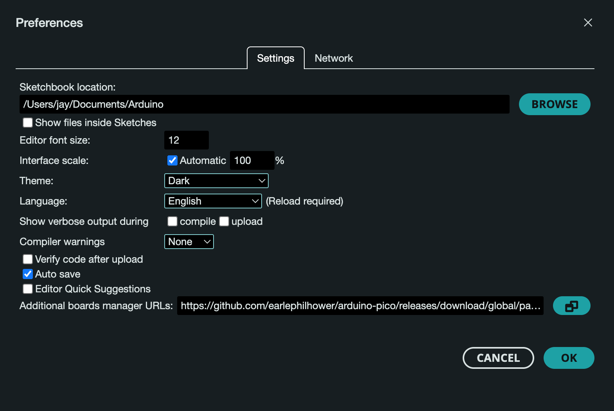

# Experiments on Raspberry Pi Pico W

This repository contains setup, configuration and code for various experiments on Pico W device.

<br>

## Experiments

- [Blink](./blink/README.md) - classic exercise to verify the basis.


<br>

## Thonny Setup


<br>

## Arduino Setup

In Arduino IDE, go to **Preferencess**, add the following URL to the list of **Additional Boards Manager URLs**

```
https://github.com/earlephilhower/arduino-pico/releases/download/global/package_rp2040_index.json
```



<br>

## PlatformIO Setup

In VSCode, add **PlatformIO IDE** extension.


<br>


