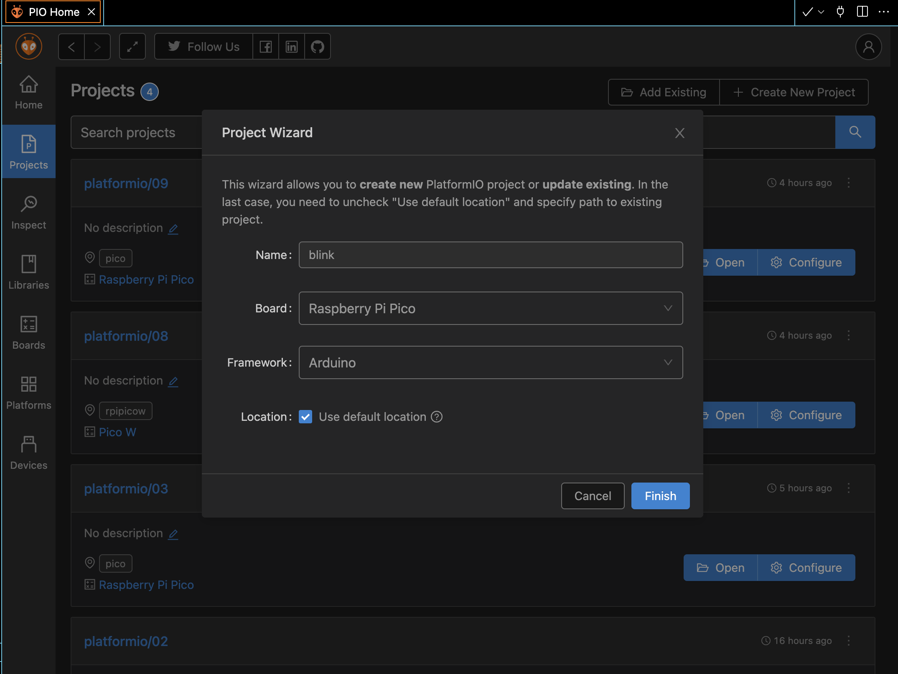

# Blink

## Thonny

In Thonny IDE, create a new file `main.py`.

See [main.py](./thonny/main.py) for the python code.

 

## Arduino

In Arduino IDE, create a new sketch and select **Raspberry Pi Pico W** board.

See [blink.ino](./arduino/blink.ino) for the arduino code.

 

## PlatformIO

In vscode, create a new project. Select **Raspberry Pi Pico** for the board option.

Create a new file [main.cpp](./platformio/main.pp) under `src` directory.

Create a new file [platformio.ini](./platformio/platformio.ini) under the project's root directory.

 

**Note**

See the [Current state of development](https://github.com/earlephilhower/arduino-pico/blob/master/docs/platformio.rst#current-state-of-development) for the explanation for the reason of specifying `platform` and `board_build.core` configurations.

Also read the thread on [Raspberry Pi Pico W in platformIO](https://community.platformio.org/t/raspberry-pi-pico-w-in-platformio/32006/2) for the example of using `rpipicow` board for working with `Pico W` as the official supported `pico` board won't work for `Pico W`.

 
