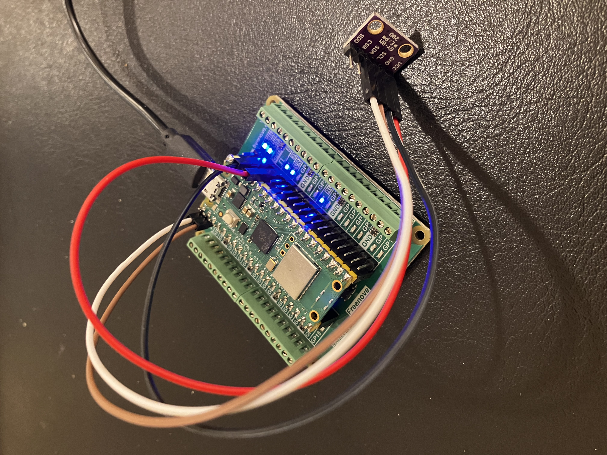
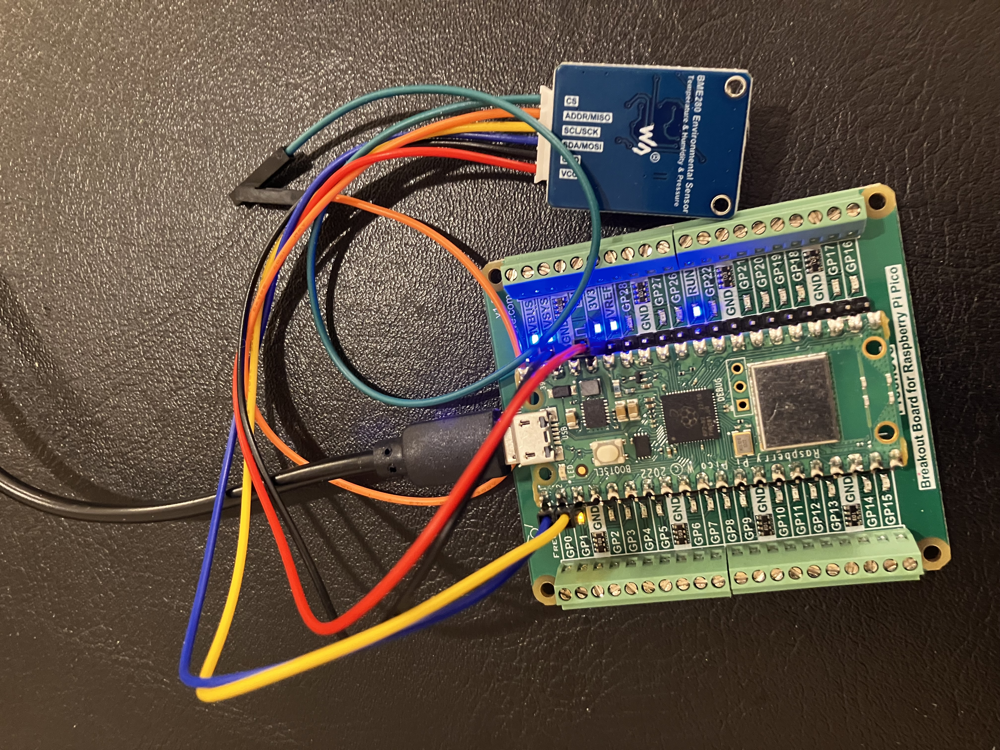
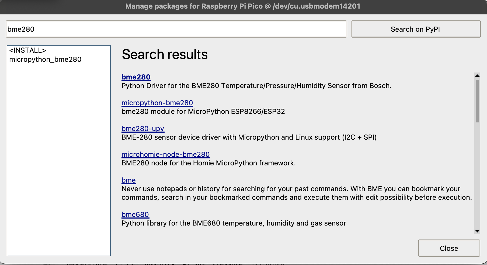
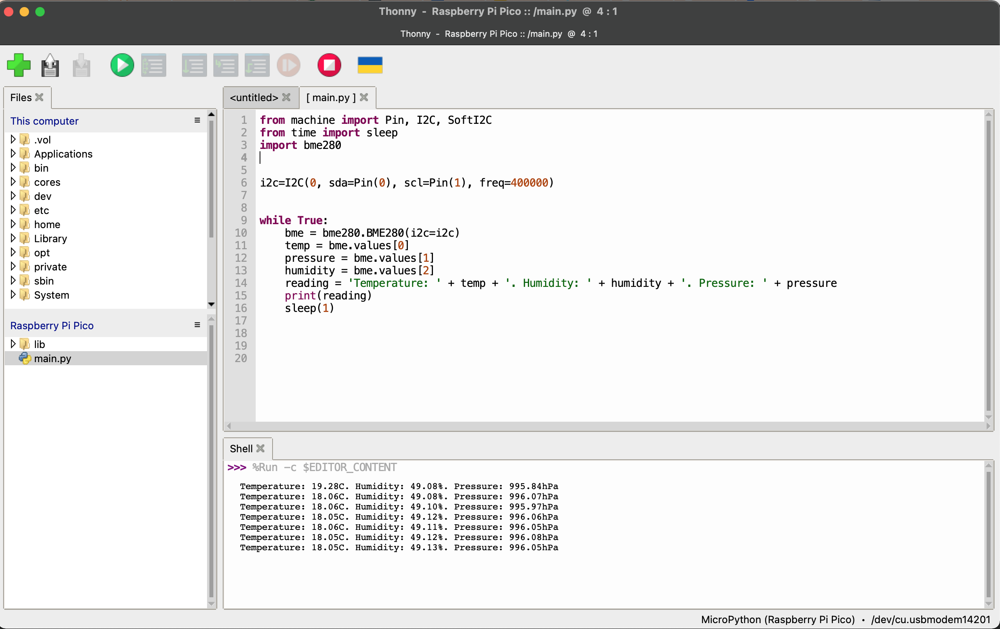
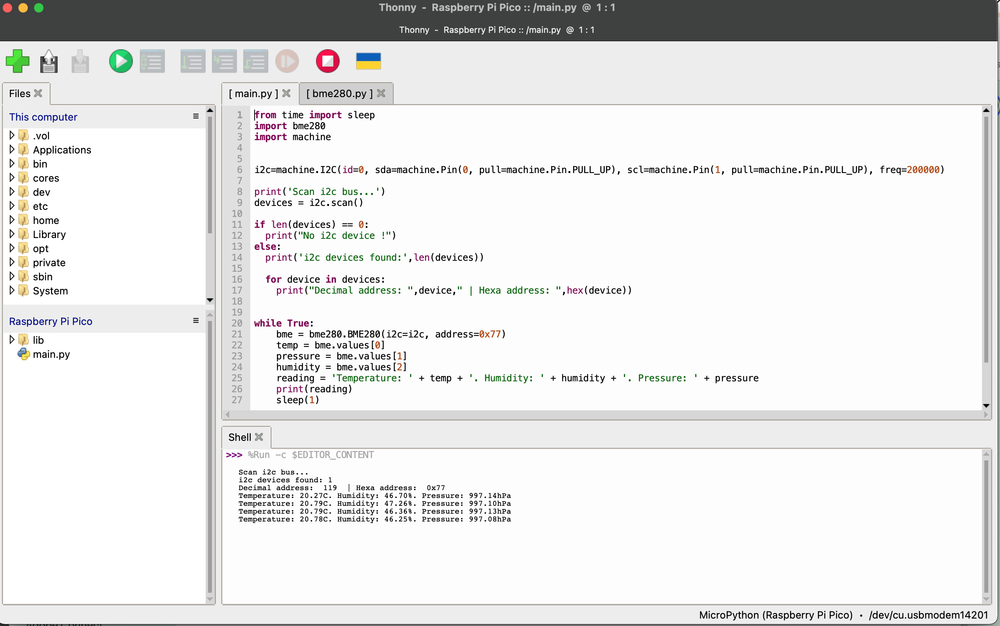
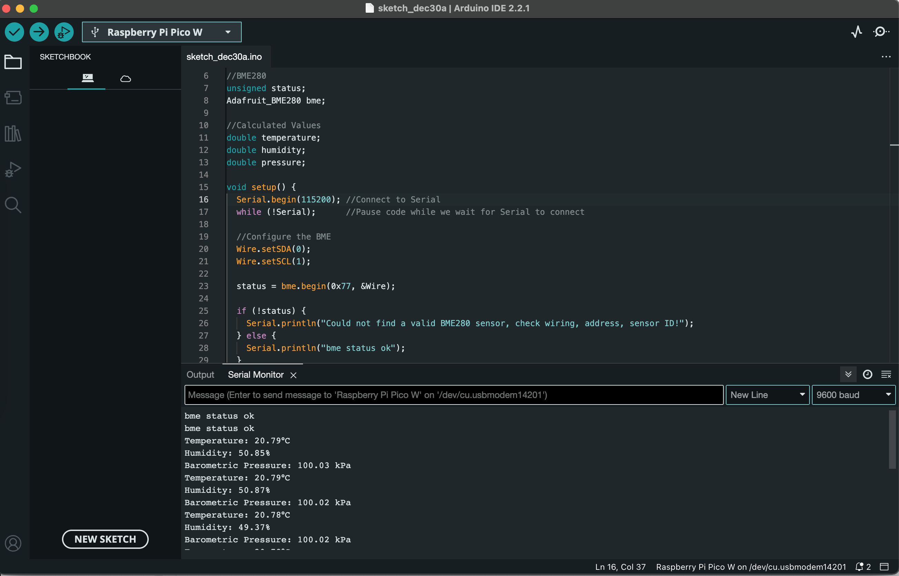
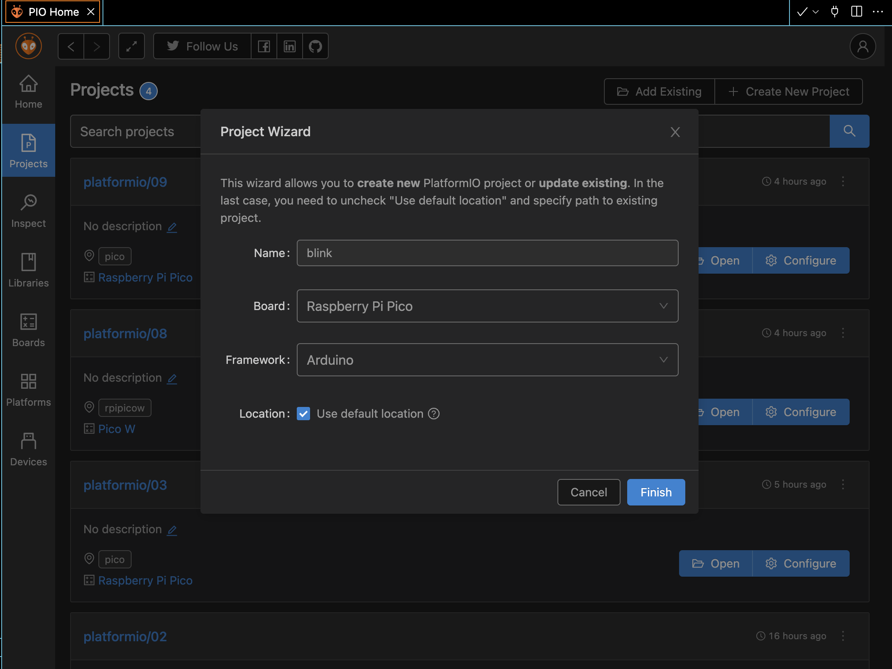
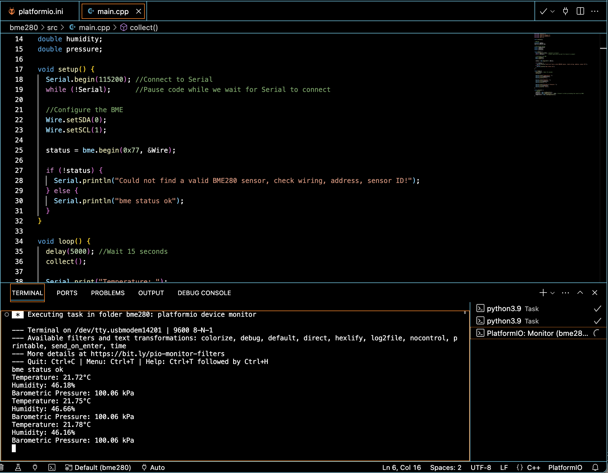
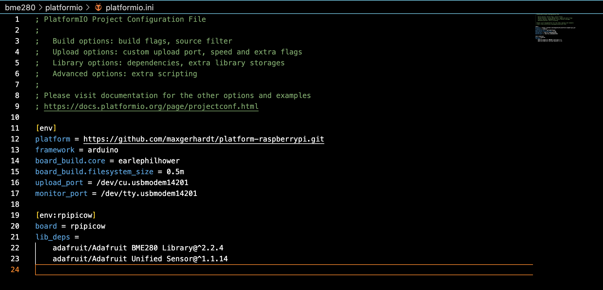

# BME280

This section contains sensor examples implemented in 3 different ways (Thonny, Arduino and PlatformIO).


<br>

## Sensors

- SHILLEHTEK PRE-SOLDERED BME280 3.3V High Precision Altimeter Atmospheric Pressure, Temperature, and Humidity GY-BME280-3.3 Sensor Module for Raspberry Pi, Arduino, and Other MicroControllers (see [Amazon link](https://www.amazon.com/gp/product/B0BQFV883T/ref=ppx_yo_dt_b_asin_title_o08_s00?ie=UTF8&psc=1), [Product Link](https://shillehtek.com/products/pre-soldered-bme280-3-3v-high-precision-altimeter-atmospheric-pressure-temperature-and-humidity-gy-bme280-3-3-sensor-module-for-raspberry-pi-arduino-and-other-microcontrollers))
<br>
    
<br>

- Waveshare BME280 Environmental Sensor Temperature Humidity Barometric Pressure Atmospheric Pressure Support I2C and SPI Interface Compatible with 3.3V/5V Voltage Levels (see [Amazon link](https://www.amazon.com/gp/product/B088HJHJXG/ref=ppx_yo_dt_b_asin_title_o07_s00?ie=UTF8&psc=1), [Product link](https://www.waveshare.com/wiki/BME280_Environmental_Sensor))
<br>
    


<br>

## Thonny

From **Tools** -> **Manage packages**, install `micropython-bme280` package. 




In Thonny IDE, create a new file `main.py`.

See [main.py](./thonny/main.py) for the python code.



Note that, this version of python code works for ShillehTek's sensor but not for Waveshare's. The reason is that default bme280 address is set to `0x76`.

In order for working with Waveshare's sensor, we need to set the address to`0x77`.

See [main_address_77.py](./thonny/main_address_77.py) for the python code. In this version, we also scan the i2c to show us the address the sensor is using. The output is shown below.

```
Scan i2c bus...
i2c devices found: 1
Decimal address:  119  | Hexa address:  0x77
```

<br>



<br>

## Arduino

In Arduino IDE, create a new sketch and select **Raspberry Pi Pico W** board.

Also install `Adafruit BME280 Library` library first. This will also install other dependent libraries.

See [bme280.ino](./arduino/bme280.ino) for the arduino code. This version is tested on Waveshare's sonesor wtih address at `0x77`.





<br>

## PlatformIO


In vscode, create a new project. Select **Raspberry Pi Pico** for the board option. The screenshot below is taken from [blink](../blink/README.md) example.




Create a new file [main.cpp](./platformio/main.cpp) under `src` directory.




Create a new file [platformio.ini](./platformio/platformio.ini) under the project's root directory.


 


**Note**

Similarily, please read the blink section's [README](../blink/README.md) first.

<br>

