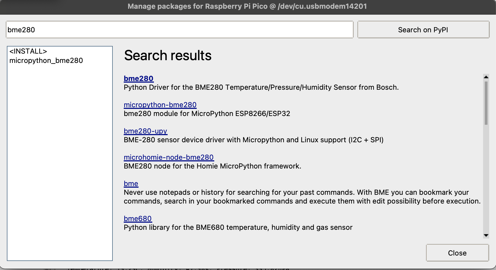
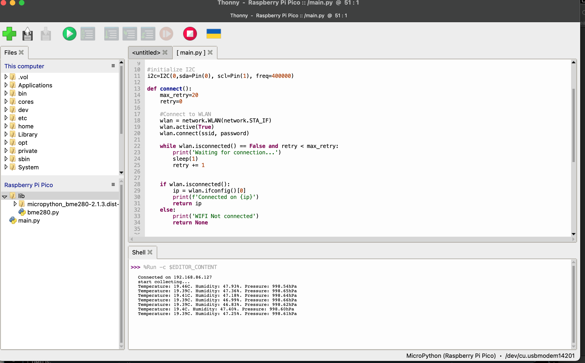

# wifi connection

This section contains wifi examples implemented in 3 different ways (Thonny, Arduino and PlatformIO).

The example also contains bme280 piece since it is built on top of the bme280 case.

 

## Sensors

This section uses Waveshare's sensor (described in [blink](../blink/README.md) section) and with i2c address at `0x77`.

## Thonny

From **Tools** -> **Manage packages**, install `micropython-bme280` package. 

In Thonny IDE, create a new file `main.py`.

See [main.py](./thonny/main.py) for the python code.

**Note**

Remember to provide your wifi network name and password (`ssid` and `password` variables).

 

## Arduino

In Arduino IDE, create a new sketch and select **Raspberry Pi Pico W** board.

Also install `Adafruit BME280 Library` library first. This will also install other dependent libraries.

See [wifi.ino](./arduino/wifi.ino) for the arduino code. This version is tested on Waveshare's sonesor wtih address at `0x77`.

**Note**

Remember to provide your wifi network name and password (`ssid` and `password` variables).

<b>

## PlatformIO

In vscode, create a new project. Select **Raspberry Pi Pico** for the board option. The screenshot below is taken from [blink](../blink/README.md) example.

Create a new file [main.cpp](./platformio/main.cpp) under `src` directory.

Create a new file [platformio.ini](./platformio/platformio.ini) under the project's root directory.

 

**Note**

Similarily, please read the blink section's [README](../blink/README.md) first.

 

